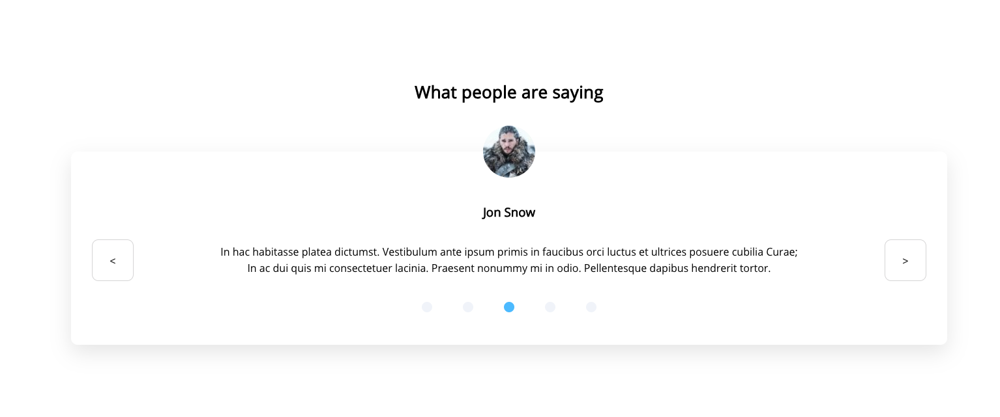
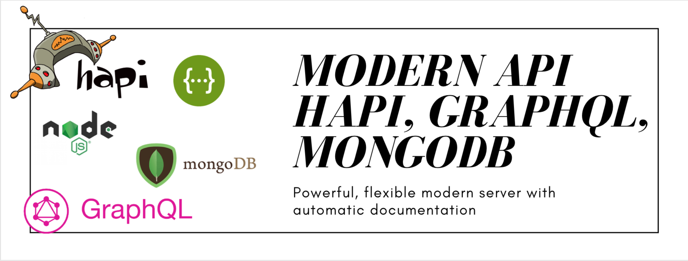
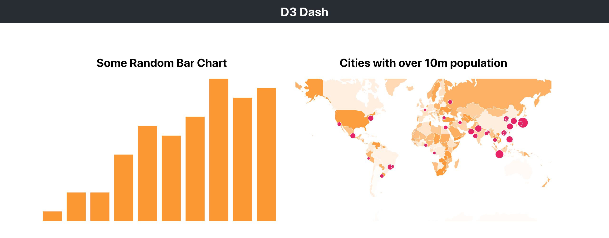
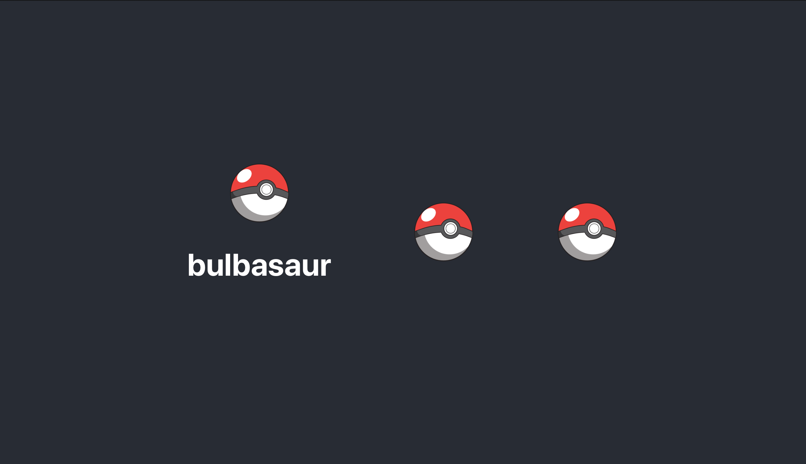

# NEW TECH SANDBOX

> Learning new technologies and implementing them into your work is one of the main tasks a webdev/software engineer faces. Instead of cluttering up my github with hundreds of small repos, I've decided to keep one master repo of all of the tech I'm learning. Small projects where I begin to implement new languages, packages, services, or techniques will be listed here.

## [React Hooks](https://github.com/destiny-ross-dev/new-tech-sandbox/tree/master/hooks-carousel)



Since their introduction, React Hooks have been hailed as _the_ solution to state management, allowing developers to use state and other React features without writing a class. I implemented a carousel using the useState, useEffect, and useRefs hooks and even wrote my own hook, **useInterval**! For this component to work, I also had to learn about Javascript's _setInterval_ and _clearInterval_ functions.

## [Modern Api - Node, Hapi, GraphQL, MongoDB, Swagger](https://github.com/destiny-ross-dev/new-tech-sandbox/tree/master/hooks-carousel)



A powerful and flexible web api built with Node, Hapi, GraphQL, and MongoDB. Hapi enables developers to focus on writing reusable application logic instead of spending time building infrastructure and is an extremely powerful tool that simplifies our code. GraphQL allows the client to make requests for data in the format it wants to consume it. I combined the two with this simple application.


## [CSV Upload and Parser - Node, Multer, PapaParse](https://github.com/destiny-ross-dev/new-tech-sandbox/tree/master/upload-parse-csv-node-multer)

NodeJs is built atop of C++ code which gives us devs the ability to change the computer's internals. I decided it was time to explore the 'fs' library to manipulate the filesystem by downloading files to and reading files from the drive. I also used PapaParse to parse the csv files to JSON to send back to the client. Check out how easy it is with the snippet below!

```javascript
app.get("/files", function(req, res) {
  let fileArray = [];
  fs.readdirSync(publicFolder).forEach(file => {
    fileArray.push(file);
  });

  res.status(200).json(fileArray);
});

app.get("/files/:filename", function(req, res) {
  let { filename } = req.params;
  let csvPath = `${publicFolder}/${filename}.csv`;
  const file = fs.createReadStream(csvPath);
  let data = {};

  papa.parse(file, {
    header: true,
    download: false,
    complete(results) {
      data = { rows: results.data, fields: results.meta.fields };
      res.status(200).json(data);
    }
  });
});
```

## [D3/React Data Visualizations](https://github.com/destiny-ross-dev/new-tech-sandbox/tree/master/d3-data-vis)



D3 brings data to life. D3.js is a JavaScript library for producing dynamic, interactive data visualizations in web browsers. I built three visualizations with varying difficulty and features. My first chart was a simple bar chart, nothing special there, but they _are_ one of the most widely utilized chart types. Next, a topojson powered World Map, with hotspots showing the largest cities in the world (10m+ population). Then, I took a stab with d3's powerful brush and filter features and made an interactive histogram/area chart combo.

## [Redis Data Cache](https://github.com/destiny-ross-dev/new-tech-sandbox/tree/master/redis-pokedex)

Redis is an open source (BSD licensed), in-memory data structure store, used as a database, cache and message broker. In this app, I cached data from the pokeapi and use it to display a common scene, for all who have played pokemon.



## [Typescript](https://github.com/destiny-ross-dev/new-tech-sandbox/tree/master/typescript-test)

## [State Management with Observables](https://github.com/destiny-ross-dev/new-tech-sandbox/tree/master/rxjs-react-observables)

## [BrainJs for Machine Learning](https://github.com/destiny-ross-dev/new-tech-sandbox/tree/master/brainjs-machine-learning)

## [Webscraping with Cheerio](https://github.com/destiny-ross-dev/new-tech-sandbox/tree/master/webscraping-express-cheerio)

## [Lazy Loading with Suspense](https://github.com/destiny-ross-dev/new-tech-sandbox/tree/master/lazy-loading-suspense)
